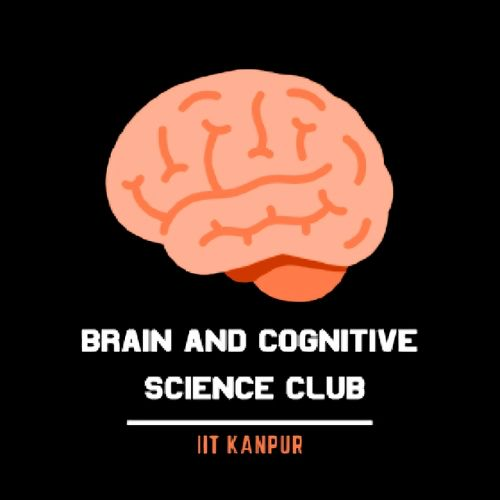
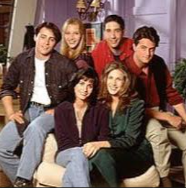

#🧠 Cerebral Cinema
<div align="center">

<table>
<tr>
<td align="left" width="35%">

</td>

<td align="center" width="65%">

</td>
</tr>
</table>

</div>

This GitHub repository contains data and code for the Cerebral Cinema Project with has close resemblence with the Algonauts Competition 2025. 
<div align="center">
  
### Predicting Human Brain Activity from Multimodal Movie Stimuli using Transformers


[](https://www.python.org)

[](https://pytorch.org)

[](LICENSE)

[](#dataset)

</div>

---

## 📖 Overview

**Cerebral Cinema** is a multimodal brain encoding framework that predicts fMRI responses while participants watch episodes of the TV series *Friends*.

The project combines **semantic information from dialogue transcripts** and **visual representations extracted from video clips**, fuses them through a **Transformer encoder**, and predicts whole-brain activity represented using the **1000-parcel Schaefer atlas**.

The framework is inspired by recent advances in multimodal brain decoding, including the **TRIBE** architecture and the **Algonauts Challenge**, while extending them to movie-based naturalistic stimuli.

---

## 🎯 Objectives

- Predict cortical brain activity from natural movie stimuli.
- Learn joint representations of language and vision.
- Investigate multimodal fusion for neuroscience.
- Build an interactive platform for visualizing predicted brain activity.

---

# 🏗 Project Pipeline

<p align="center">

</p>

The overall pipeline consists of:

1. Movie & transcript preprocessing
2. Feature extraction
3. Multimodal fusion
4. Transformer-based brain encoding
5. fMRI prediction
6. Brain activity visualization

---

# 📂 Dataset

The project uses the **Friends** naturalistic movie dataset collected from **four participants**.

Each participant watched episodes from **Friends Seasons 1–6** while undergoing functional MRI scans.

The dataset contains:

- 🎬 Video clips
- 💬 Dialogue transcripts
- 🧠 fMRI recordings
- ⏱ Time-aligned stimulus-response pairs

### Dataset Statistics

| Modality | Description |
|-----------|-------------|
| Video | Friends Seasons 1–6 |
| Text | Episode transcripts |
| Subjects | 4 |
| Brain Regions | 1000 Schaefer parcels |
| Imaging | Functional MRI (BOLD) |

---

# ⚙️ Feature Extraction

### 📝 Text Features

Dialogue transcripts are encoded using **TinyLlama**, producing **2048-dimensional semantic embeddings**.

Temporal context is preserved using **8-TR sliding windows**.

---

### 🎥 Visual Features

Video clips are processed using **VideoMAE**, generating

**8 × 768-dimensional temporal visual embeddings**.

These embeddings capture both spatial and temporal visual information.

---

### 🔗 Multimodal Fusion

For every TR:

- Text window
- Video embedding

are concatenated to create a unified multimodal representation before being fed into the Transformer.

---

# 🧠 fMRI Preprocessing

Functional MRI recordings were preprocessed using **fMRIPrep**.

The preprocessing pipeline includes:

- Motion correction
- Slice timing correction
- Spatial normalization
- Registration to MNI space
- Schaefer-1000 cortical parcellation
- Session-wise z-score normalization

A **5-TR hemodynamic delay** is incorporated to align neural activity with presented stimuli.

---

# 🤖 Model Architecture

<p align="center">

</p>

Our model consists of:

- Modality Dropout
- Linear Projection
- Positional Encoding
- CLS Token
- Transformer Encoder
- Prediction Head

### Transformer Configuration

| Component | Value |
|------------|------|
| Encoder Layers | 4 |
| Attention Heads | 8 |
| Hidden Dimension | 384 |
| Feed Forward | 1024 |
| Activation | GELU |
| Output | 1000 Brain Parcels |

---

# 🚀 Training Strategy

Training incorporates several modern optimization techniques:

- ✅ AdamW Optimizer
- ✅ Cosine Annealing Learning Rate
- ✅ Early Stopping
- ✅ Stochastic Weight Averaging (SWA)
- ✅ Mixed Precision Training
- ✅ Modality Dropout

Training:

- Seasons **1–5**

Testing:

- Season **6**

---

# 📈 Results

Example prediction from one cortical parcel:

<p align="center">

</p>

Performance metric:

- Pearson Correlation

| Split | Pearson |
|---------|----------|
| Validation | xx.xxx |
| Test | xx.xxx |

---

# 🌐 Interactive Website

A web interface is being developed to explore multimodal brain decoding interactively.

### Planned Features

- 🎬 Upload movie clips
- 💬 View transcript embeddings
- 🧠 Predict brain activity
- 📈 Compare predicted vs actual fMRI
- 🌍 Interactive cortical brain visualization
- 📊 Attention map visualization

---

# 📁 Repository Structure

```text
Cerebral-Cinema/
│
├── assets/
│   ├── logo.png
│   ├── pipeline.png
│   ├── model_architecture.png
│   └── prediction.png
│
├── notebooks/
│
├── models/
│
├── transcripts/
│
├── video_windows/
│
├── fmri/
│
├── website/
│
├── utils/
│
├── train.py
├── evaluate.py
├── inference.py
│
└── README.md
```

---

# 🛠 Installation

```bash
git clone https://github.com/yourusername/Cerebral-Cinema.git

cd Cerebral-Cinema

pip install -r requirements.txt
```

---

# ▶️ Training

```bash
python train.py
```

---

# 📊 Evaluation

```bash
python evaluate.py
```

---

# 📜 Citation

If you use this work, please cite:

```bibtex
@misc{cerebralcinema2026,
  title={Cerebral Cinema: Predicting Human Brain Activity from Multimodal Movie Stimuli},
  author={Milind Bathla},
  year={2026}
}
```

---

# 🙏 Acknowledgements

- Meta AI (VideoMAE)
- TinyLlama
- fMRIPrep
- CNeuroMod
- Schaefer Atlas
- PyTorch
- Algonauts Challenge
- TRIBE
